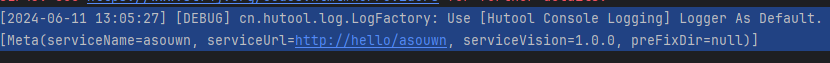

# 注册于服务中心
基于spi机制来管理，实现功能的增加与热插拔，方便后续更新

提供一个接收key的工厂类，实现返回key对应的接口实现类
## 支持快速启动
1. 将register目录下的接口修改为所需
2. 重写对应实现类的值
3. 使用'RegisterFactory.getInstance("local")' 即可快速启动本地注册中心
## 支持自定义增加
1. 将自己的实现类写入
2. 将'''key="类的全限定名称"''' 的方式写入META-INF/register/regiser.Tdgister中
3. 'RegisterFactory.getInstance("key")' 即可快速自定义的注册中心
## 支持修改目录
在spi文件目录下，spiLoader类中，修改变量 PRE_SERIALIZER_DIR 即可修改读取路，也可以根据需要修改原码

## 运行截图
- 基于etcd的注册服务中心,并且存在心跳检测，此时这个服务依旧存在，可以另起一个模块，直接调用服务，并停止服务端后再试。在过去几秒钟后，就无法再获得这个服务，这个服务将自动注销。

## ToDo
- 增加基于Vert.x的监听，来响应服务发现的请求，此时还只能在本地使用
- 支持更多服务
- 简化使用
